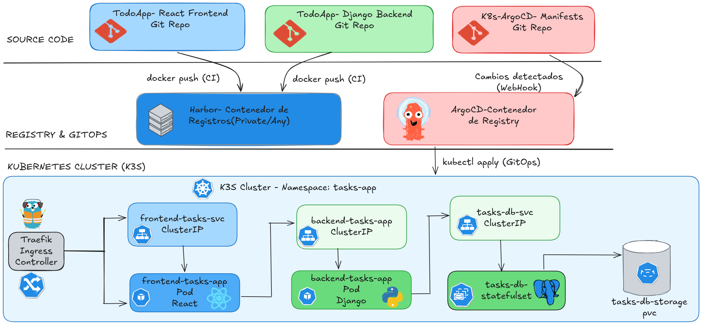

# ⚙️ Y.C. DevOps — Infrastructure & Platform Engineering

<p align="center">
  <strong>Infrastructure • DevOps • Platform Engineering</strong>
</p>

<p align="center">
  Building reliable infrastructure, automated delivery pipelines,
  and Kubernetes-based platforms.
</p>

<p align="center">
  <a href="https://TU-DOMINIO.vercel.app">🌐 Portfolio</a>
  •
  <a href="https://github.com/yclicourt">📂 GitHub</a>
  •
  <a href="https://www.linkedin.com/in/yoancarlos/">💼 LinkedIn</a>
</p>

---

## 👨‍💻 About

I'm an Infrastructure / DevOps Engineer focused on building and
automating modern infrastructure and delivery platforms.

My main areas of interest are:

- ⚙️ Infrastructure as Code
- ⛵ Kubernetes and container platforms
- 🔄 CI/CD automation
- 🚀 GitOps
- 🏗️ Platform Engineering
- ⚡ Infrastructure automation
- 📊 Observability
- ☁️ Cloud-native technologies

This portfolio showcases selected projects and practical implementations
focused on infrastructure, automation, deployment and platform engineering.

---

## 🛠️ Tech Stack

### 🧱 Infrastructure & Automation

- Terraform
- Ansible
- Docker
- Kubernetes
- K3s
- Helm
- Kustomize

### 🔄 CI/CD & GitOps

- GitHub Actions
- GitLab CI/CD
- ArgoCD
- GitOps

### 🐳 Containers & Registries

- Docker
- Harbor
- Trivy

### 📈 Observability

- Prometheus
- Grafana
- Loki
- OpenTelemetry

### 🖥️ Infrastructure & Virtualization

- VMware
- ESXi
- vCenter
- Proxmox
- TrueNAS
- pfSense

---

## 🌟 Featured Projects

### ⚡ TaskApp GitOps Kubernetes Platform

A production-oriented DevOps platform designed to demonstrate
modern application delivery practices on Kubernetes.

The project focuses on the infrastructure and delivery platform
rather than the application itself.

**Key technologies**

- Kubernetes / K3s
- Terraform
- Helm
- GitHub Actions
- ArgoCD
- Harbor
- Trivy
- Docker

**Architecture**



**Repository**

[View project →](https://github.com/yclicourt/deploy-gitOps-app)

---

## 🌐 Portfolio

The portfolio website presents my background, technical skills,
projects and experience across infrastructure, DevOps and
platform engineering.

### Built with

- React
- Vite
- TypeScript
- Tailwind CSS

### Deployment

The portfolio is deployed using Vercel.

**Live website:**

https://TU-DOMINIO.vercel.app

---

## 🎯 Engineering Focus

I'm particularly interested in building platforms that make
software delivery more reliable, repeatable and observable.

My current focus includes:

```text
Infrastructure as Code
        ↓
Containerization
        ↓
Kubernetes
        ↓
CI/CD
        ↓
GitOps
        ↓
Observability
        ↓
Platform Engineering